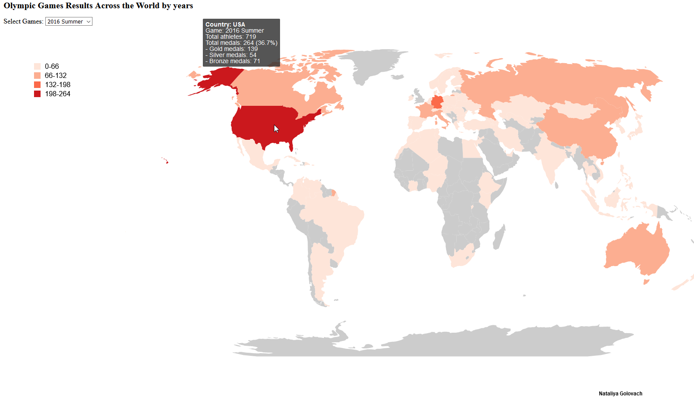

# chloropleth_olympic
Olympic Games Results Across the World by years from Athens 1896 to Rio 2016 on Chloropleth map

The data was downloaded from Kaggle https://www.kaggle.com/heesoo37/120-years-of-olympic-history-athletes-and-results.

I manipulated data first to created csv that I needed for map. 

The map shows results for each Games with colorcode (based on total medal quantity for each Country).
The drop-down list is here to choose for which games map shows the results.

The tiptool (mouseover) shows the detailed data for each country, includes:
- total quantity of athletes that were participating for the country, 
- total amount of medals
- amount of medals of each type: Gold, Silver and Bronze
